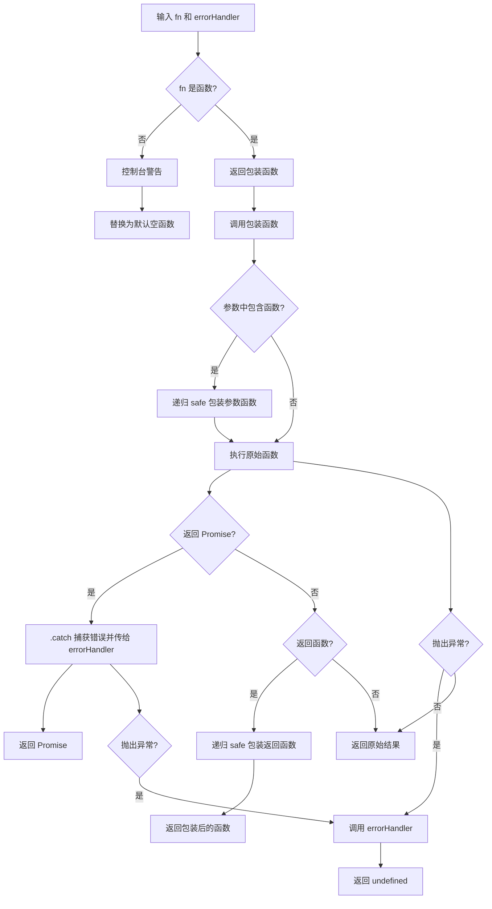

# safe

用错误处理包装一个函数，确保任何抛出的错误（同步或异步）都被捕获，出错时返回 `undefined`。同时支持递归包装参数中的函数和返回值中的函数。

## 示例

### 基本用法

```typescript
import { safe } from '@esdora/kit'

const add = (a: number, b: number) => a + b
const safeAdd = safe(add)

safeAdd(1, 2) // => 3
safeAdd(-1, 2) // => 3（不会抛错，正常返回）
```

### 捕获同步异常

```typescript
import { safe } from '@esdora/kit'

function strictAdd(a: number, b: number) {
  if (a < 0 || b < 0) {
    throw new Error('Negative numbers are not allowed')
  }
  return a + b
}

const safeStrictAdd = safe(strictAdd)

safeStrictAdd(1, 2) // => 3
safeStrictAdd(-1, 2) // => undefined（错误被捕获）
```

### 使用错误处理器

```typescript
import { safe } from '@esdora/kit'

function strictAdd(a: number, b: number) {
  if (a < 0 || b < 0) {
    throw new Error('Negative numbers are not allowed')
  }
  return a + b
}

const safeStrictAdd = safe(strictAdd, (err) => {
  console.error('捕获到错误:', err)
})

safeStrictAdd(-1, 2) // => undefined，同时触发错误处理器
```

### 包装异步函数

```typescript
import { safe } from '@esdora/kit'

async function asyncAdd(a: number, b: number) {
  if (a < 0 || b < 0) {
    throw new Error('Negative numbers are not allowed')
  }
  return a + b
}

const safeAsyncAdd = safe(asyncAdd)

await safeAsyncAdd(1, 2) // => 3
await safeAsyncAdd(-1, 2) // => undefined（Promise 错误被捕获）
```

### 包装高阶函数

```typescript
import { safe } from '@esdora/kit'

const makeAdder = (a: number, b: number) => (c: number) => a + b + c
const safeMakeAdder = safe(makeAdder)

const add123 = safeMakeAdder(1, 2)
add123(3) // => 6（返回的函数也被 safe 包装）
```

### 包装含函数参数的函数

```typescript
import { safe } from '@esdora/kit'

function process(a: number, callback: (x: number) => number, b: string) {
  return `${a}-${callback(a)}-${b}`
}

const safeProcess = safe(process)

safeProcess(5, (x: number) => x * 2, 'test') // => '5-10-test'
```

## 签名

```typescript
function safe<T extends (...args: any[]) => any>(
  fn: T,
  errorHandler?: (err: any, handler?: (err: any) => void) => void,
): (...args: Parameters<T>) => ReturnType<T> | undefined
```

## 参数

| 参数           | 类型                                               | 描述                                           | 必需 |
| -------------- | -------------------------------------------------- | ---------------------------------------------- | ---- |
| `fn`           | `T`                                                | 需要安全包装的函数                             | 是   |
| `errorHandler` | `(err: any, handler?: (err: any) => void) => void` | 可选的错误处理函数，接收错误和一个可选的处理器 | 否   |

## 返回值

- **类型**: `(...args: Parameters<T>) => ReturnType<T> | undefined`
- **说明**: 一个与原始函数参数相同的新函数，正常执行时返回原始函数的返回值，出错时返回 `undefined`
- **特殊情况**:
  - 如果 `fn` 不是函数，返回一个默认的空函数，调用时始终返回 `undefined`，并在控制台输出警告
  - 如果 `fn` 返回 Promise，出错时返回 `Promise<undefined>`
  - 如果 `fn` 返回函数，返回的函数也会被递归包装为 safe 版本
  - 如果 `fn` 的参数中包含函数，这些参数函数也会被递归包装为 safe 版本

## 运行逻辑



函数的核心逻辑是：在执行原始函数前后进行多层拦截——先包装参数中的函数，再拦截 Promise 的 reject，最后捕获同步抛出的异常。任何错误路径都会调用 `errorHandler` 并返回 `undefined`。

## 注意事项

### 输入边界

- 传入非函数值（如 `undefined`）时，`safe` 会将其替换为一个默认空函数，调用时始终返回 `undefined`，并在控制台输出警告
- 参数中的函数会被递归包装，确保回调函数内部抛出的错误也能被捕获
- 返回值中的函数也会被递归包装，适用于高阶函数场景
- `this` 上下文会被正确保留，支持将包装后的函数作为对象方法使用

### 错误处理

- 同步错误：通过 `try/catch` 捕获，调用 `errorHandler` 后返回 `undefined`
- 异步错误：通过 `Promise.prototype.catch` 捕获，调用 `errorHandler` 后返回 `Promise<undefined>`
- 非 `Error` 类型的抛出值（如 `throw 'string'`）也会被正确捕获并传递给 `errorHandler`
- 如果不提供 `errorHandler`，错误会被静默捕获，仅返回 `undefined`

### 性能考虑

- **时间复杂度**: O(1) — 每次调用仅涉及一次函数调用和若干类型判断
- **空间复杂度**: O(1) — 不创建额外数据结构，仅返回包装函数
- 递归包装参数和返回值中的函数会带来额外的函数调用开销，但在大多数场景下可忽略

## 相关链接

- [源码](https://github.com/kkfive/esdora/blob/main/packages/kit/src/function/safe/safe.ts)
- [单元测试](https://github.com/kkfive/esdora/blob/main/packages/kit/src/function/safe/safe.test.ts)
- [createSafe](./create-safe.md) — 创建可复用的自定义安全包装器
- [\_JSON](./json.md) — 基于 safe 的安全 JSON 解析与序列化
